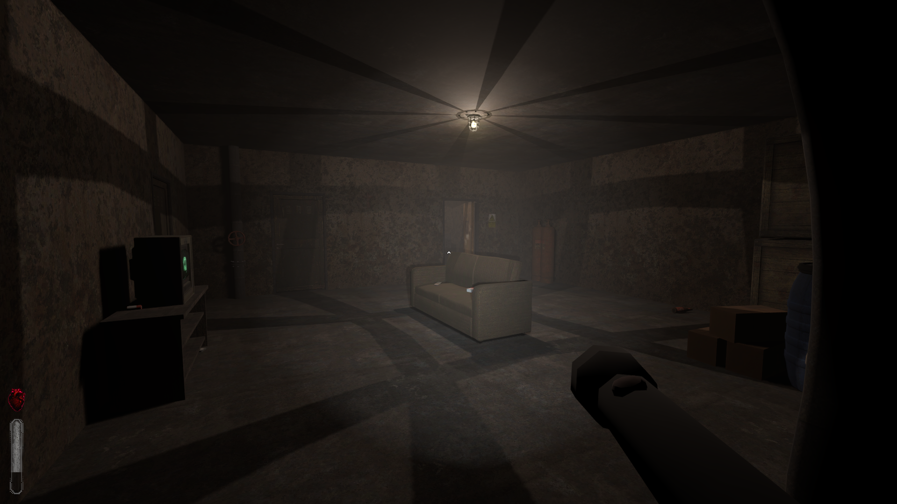
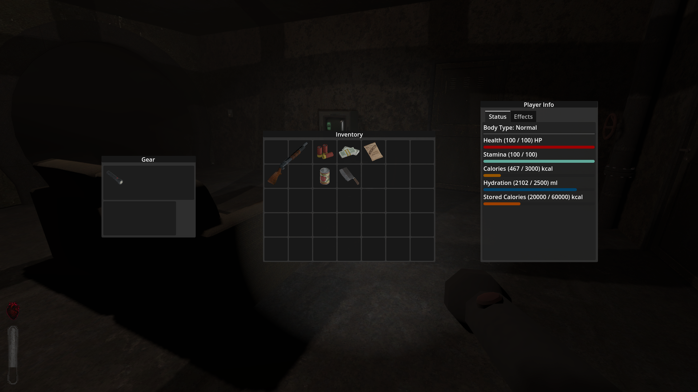

# Sunlessbound-preview
Sunlessbound is a 3D multiplayer post-apocalyptic survival game where the player lives in a bunker to protect themselves from the deadly sun burning outside. At night, when the sun disappears, the player must go out to explore and gather resources while avoiding dangerous monsters roaming the darkness.

Inventory system

## Current Systems Implemented

- Player movement
- Inventory system  
- Partial vitality system (in progress)  

## Systems Planned for Implementation

- Enemy AI and behavior  
- Crafting and building mechanics for the bunker  
- Multiplayer functionality  
- Advanced resource management and survival mechanics  
- Night exploration and monster encounter systems  

## Assets Source

Most of the assets used in this project are from [https://pizzadoggy.itch.io/](https://pizzadoggy.itch.io/).

## License Notice
Due to licensing restrictions on the assets used in this project, the assets themselves cannot be uploaded to this GitHub repository. This preview repository is intended solely to showcase the code.

**All rights reserved. No part of this project may be used, copied, modified, or distributed without explicit permission.**
